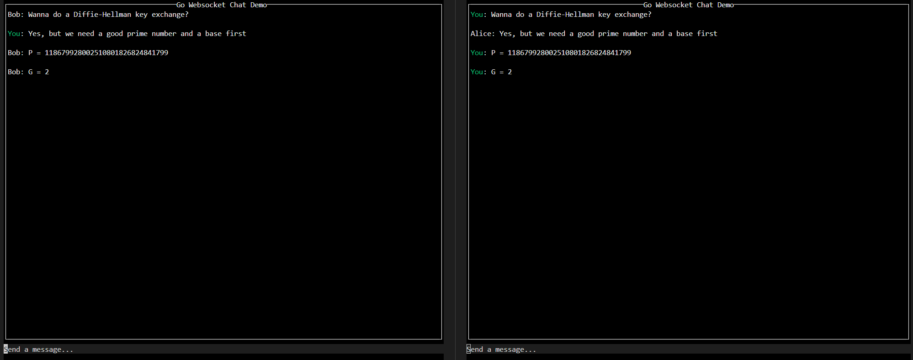

# Go Websocket Chat



## A simple TCP websocket and encryption demo

This is a very simple console-based chat program. It supports an arbitrary number of simultaneous client connections and features end-to-end encryption between all clients. The code is divided between the server and the client. The server supports one chatroom.

While the chat is encrypted, it is definitely not secure. This was a quick project just to get something working; I did not have security in mind. Any number of attacks could theoretically compromise the messages. If I truly wanted this to be unbreachable, maybe I would implement something like the Signal protocol.


### Inital setup
After cloning the repo, `cd` into the project directory and set up the Go modules.
```bash
cd go-websocket-chat
go mod tidy
```

### Running the server
```bash
cd server
go run .
```
The default port is 8080. To specify a port to listen on:
```bash
go run . -port <port number>
```

### Running the client
```bash
cd client
go run . -username <your username>
```
The default host is `localhost:8080`. To specify a different host or port, use the `-host` and `-port` options:
```bash
go run . -username <your username> -host <hostname> -port <port-number>
```